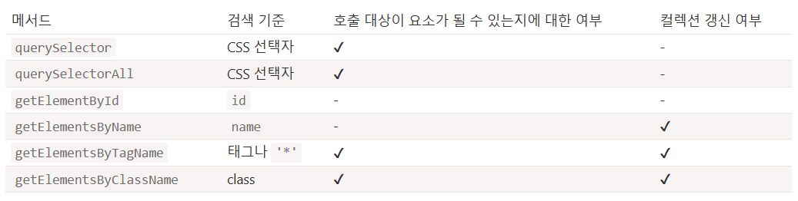

## getElement*, querySelector*로 요소 검색하기

요소들이 가까이 붙어있다면 앞에서 학습한 DOM 탐색 프로퍼티를 사용해 목표 요소에 쉽게 접근할 수 있다. 그런데, 요소들이 가까이 붙어있지 않은 경우도 있기 마련이다. 상대 위치를 이용하지 않으면서 웹 페이지 내에서 원하는 요소 노드에 접근하는 방법은 무엇일까?

이를 가능하게 해주는 메서드에 대해 알아보자.

## document.getElementById 혹은 id를 사용해 요소 검색하기

요소에 `id` 속성이 있으면 위치에 상관없이 메서드 `document.getElementById(id)`를 이용해 접근할 수 있다.

    

      
Element

      

    

이에 더하여 `id` 속성값을 그대로 딴 전역 변수를 이용해 접근할 수도 있다.

    

    

**id를 따서 만들어진 전역변수를 요소 접근 시 사용하지 말 것**

`id`에 대응하는 전역변수는 명세서의 내용을 구현해 만들어진 것으로 표준이긴 하지만 하위 호환성을 위해 남겨둔 동작이다.

브라우저는 스크립트의 네임스페이스와 DOM의 네임스페이스를 함께 사용할 수 있도록 해서 개발자의 편의를 도모한다. 그런데 이런 방식은 스크립트가 간단할 땐 괜찮지만, 이름이 충동할 가능성이 있기 때문에 추천하는 방식은 아니다. HTML을 보지 않은 상황에서 코드만 보고 변수의 출처를 알기 힘들다는 단점도 있다.

## quertSelectorAll

`elem.quertSelectorAll(css)`은 다재다능한 요소 검색 메서드이다. 이 메서드는 `elem`의 자식 요소 중 주어진 CSS 선택자에 대응하는 요소 모두를 반환한다.

아래 코드는 마지막 `<li>` 요소 모두를 반환한다.

    <ul>
      <li>1-1</li>
      <li>1-2</li>
    </ul>
    <ul>
      <li>2-1</li>
      <li>2-2</li>
    </ul>
    

`querySelectorAll`은 CSS 선택자를 활용할 수 있다는 점에서 아주 유용하다.

**가상 클래스도 사용할 수 있다.**    
querySelectorAll에는 `:hover`나 `:active` 같은 CSS 선택자의 가상 클래스도 사용할 수 있다.

`document.querySelectorAll(':hover')`을 사용하면 마우스 포인터가 위에 있는 요소 모두를 담은 컬렉션이 반환된다. 이때 컬렉션은 DOM 트리 최상단에 위치한 `<html>` 부터 가장 하단의 요소 순으로 채워진다.

## querySelector
`elem.querySelector(css)`는 주어진 CSS 선택자에 대응하는 요소 중 첫 번째 요소를 반환한다.

`elem.querySelectorAll(css)[0]`과 동일하다. `elem.querySelectorAll(css)[0]`은 선택자에 해당하는 모든 요소를 검색해 첫 번째 요소만을 반환하고, `elem.querySelector`는 해당하는 요소를 찾으면 검색을 멈춘다는 점에서 차이가 있다. `elem.querySelector`가 더 빠른 이유이다. `querySelector`는 `querySelectorAll`에 비해 코드의 길이가 짧다는 장점도 있다.

## matches

지금까지 알아본 모든 메서드는 DOM 검색에 쓰인다.

`elem.matches(css)`는 DOM을 검색하는 일이 아닌 조금 다른 일을 한다. 이 메서드는 요소 `elem`이 주어진 CSS 선택자와 일치하는지 여부를 판단해준다. 일치한다면 `true`, 아니라면 `false`를 반환한다.

요소가 담겨있는 배열 등을 순회해 원하는 요소만 걸러내고자 할 때 유용하다.

    <a href="http://example.com/file.zip">...</a>
    <a href="http://ya.ru">...</a>

    

## closet

부모 요소, 부모 요소의 부모 요소 등 DOM 트리에서 특정 요소의 상위에 있는 요소들은 **조상** 요소라고 한다.

메서드 `elem.closet(css)`는 `elem` 자기 자신을 포함하여 CSS 선택자와 일치하는 가장 가까운 조상 요소를 찾을 수 있게 도와준다.

`closet` 메서드는 해당 요소부터 시작해 DOM 트리를 한 단계식 거슬러 올라가면서 원하는 요소를 찾는다. CSS 선택자와 일치하는 요소를 찾으면, 검색을 중단하고 해당 요소를 반환한다.

    <h1>목차</h1>

    

      <ul class="book">
        <li class="chapter">1장</li>
        <li class="chapter">2장</li>
      </ul>
    

    

## getElementBy*

태그나 클래스 등을 이용해 원하는 노드를 찾아주는 메서드도 있다.

`querySelector`를 이용하는 게 더 편리하고 문법도 짧아서, 요즘은 이런 메서드들을 잘 쓰진 않는다.

- `elem.getElementByTagName(tag)` - 주어진 태그에 해당하는 요소를 찾고, 대응하는 요소를 담은 컬렉션을 반환한다. 매개변수 `tag`에 `"*"`이 들어가면, '모든 태그'가 검색된다.
- `elem.getElementByClassName(className)` - class 속성값을 기준으로 요소를 찾고, 대응하는 요소를 담은 컬렉션을 반환한다.
- `document.getElementsByName(name)` - 아주 드물게 쓰이는 메서드로, 문서 전체를 대상으로 검색을 수행한다. 검색 기준은 `name` 속성값이고, 이 메서드 역시 검색 결과를 담은 컬렉션을 반환한다.

      // 문서 내 모든 div를 얻는다.
      let divs = document.getElementByTagName('div');

아래 코드는 표 안의 모든 `input` 태그를 찾는다.

    <table id="table">
      <tr>
        <td>나이:</td>

        <td>
          <label>
            <input type="radio" name="age" value="young" checked> 18세 미만
          </label>
          <label>
            <input type="radio" name="age" value="mature"> 18세 이상, 60세 미만
          </label>
          <label>
            <input type="radio" name="age" value="senior"> 60세 이상
          </label>
        </td>
      </tr>
    </table>

    

**`'s`를 절대 빠트리지 말 것**    
`getElementById`는 요소 하나만을 반환하기 때문에 `s`가 없다. `getElementsByTagName` 등의 메서드는 대응하는 요소를 담은 컬렉션을 반환하기 때문에 메서드 중간에 `"s"`가 들어간다.

**요소 하나가 아닌, 컬렉션을 반환한다.**

    // 동작하지 않는 코드
    document.getElementByTagName('input').value = 5;

input 요소 전체를 담은 컬렉션에 5를 할당하는 위 코드는 동작하지 않는다. 아마도 본래 의도는 컬렉션 내 요소에 값을 할당하는 것일텐데.

컬렉션을 순회하거나 인덱스를 사용해 요소를 얻고 그 요소에 값을 할당하면 기존 의도대로 동작한다.

    // (문서에 input 요소가 있다면) 아래 코드는 잘 동작한다.
    document.getElementByTagName('input')[0].value = 5;

아래 코드는 클래스 속성의 값이 `article`인 요소를 검색해주는 예시이다.

    <form name="my-form">
      
글

      
내용이 긴 글

    </form>

    

## 살아있는 컬렉션

`'getElementBy'`로 시작하는 모든 메서드는 **살아있는** 컬렉션을 반환한다. 문서에 변경이 있을 때마다 컬렉션이 '자동 갱신'되어 최신 상태를 유지한다.

예시 내엔 스크립트 두 개가 있다.

1. 첫 번째 스크립트는 `
`에 상응하는 요소를 담은 컬렉션에 대한 참조를 만든다. 스크립트가 실행되는 시점에 이 컬렉션의 길이는 `1`이다.
2. 두 번째 스크립트 문서에 `
` 가 하나 더 추가된 이후에 실행된다. 따라서 컬렉션의 길이는 `2`가 된다.

        
첫 번째 div

        

        
두 번째 div

        

첫 번째 div

두 번째 div

---
반면, `querySelectoreAll`은 **정적인** 컬렉션을 반환한다. 컬렉션이 한 번 확정되면 더는 늘어나지 않는다.

`querySelectorAll`을 사용하면 두 스크립트가 동일하게 `1`을 출력한다.

    
첫 번째 div

    

    
두 번째 div

    

예시를 통해 두 방식의 차이를 보았다. 문서에 새로운 `div`가 추가되어도 `querySelectorAll`이 반환한 컬렉션은 이를 반영하지 못한다.

## 요약 
DOM 에서 원하는 노드를 검색하게 해주는 주요 메서드 6가지는 다음과 같다.

아마 실무에선 `querySelector`나 `querySelectorAll`을 가장 많이 사용할 것이다. `getElementBy`로 시작하는 메서드는 대개 오래된 스크립트에서 만날 수 있는데, 일부 이 메서드가 꼭 필요한 상황에서 쓰이는 경우도 있다.

이 외에 알아두면 좋을 만한 메서드는 아래와 같다.

- `elem.matches(css)`는 `elem`이 해당 CSS 선택자와 일치하는지 여부를 검사한다.
- `elem.closest(css)`는 해당 CSS 선택자와 일치하는 가장 가까운 조상 요소를 탐색한다. 이때, `elem` 자기 자신도 검색 대상에 포함된다.

