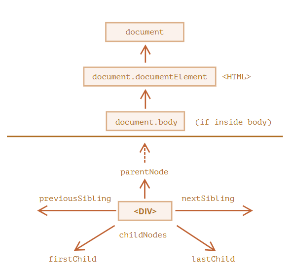

## DOM 탐색하기

DOM을 이용하면 요소와 요소의 콘텐츠의 무엇이든 할 수 있다. 하지만 무언가를 하기 전엔, 당연히 조작하고자 하는 DOM 객체에 접근하는 것이 선행되어야 한다.

DOM에 수행하는 모든 연산은 `document` 객체에서 시작한다. `document` 객체는 DOM에 접근하기 위한 '진입점'이다. 진입점을 통과하면 어떤 노드에도 접근할 수 있다.

아래 그림은 DOM 노드 탐색이 어떤 관계를 통해 이루어지는지 보여준다.

