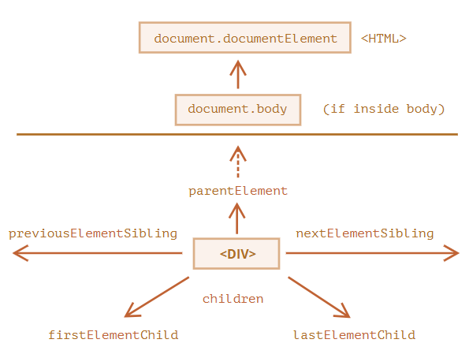

## DOM 탐색하기

DOM을 이용하면 요소와 요소의 콘텐츠의 무엇이든 할 수 있다. 하지만 무언가를 하기 전엔, 당연히 조작하고자 하는 DOM 객체에 접근하는 것이 선행되어야 한다.

DOM에 수행하는 모든 연산은 `document` 객체에서 시작한다. `document` 객체는 DOM에 접근하기 위한 '진입점'이다. 진입점을 통과하면 어떤 노드에도 접근할 수 있다.

아래 그림은 DOM 노드 탐색이 어떤 관계를 통해 이루어지는지 보여준다.

화살표로 나타낸 관계에 대하여 좀 더 알아보자.

## 트리 상단의 documentElement 와 body

DOM 트리 상단의 노드들은 `document` 가 제공하는 프로퍼티를 사용해 접근할 수 있다.

`<html>` = `document.documentElement`

`document`를 제외하고 DOM 트리 꼭대기에 있는 문서 노드는 `<html>` 태그에 해당하는 `document.documentElement`이다.

`<body>` = `document.body`

`document.body`는 `<body>` 요소에 해당하는 DOM 노드로, 자주 쓰이는 노드 중 하나이다.

`<head>` = `document.head`

`<head>` 태그는 `document.head`로 접근할 수 있다.

---

**documnet.body 가 `null` 일 수도 있으니 주의하자.**

스크립트를 읽는 도중에 존재하지 않는 요소는 스크립트에서 접근할 수 없다.

브라우저가 아직 `document.body` 를 읽지 않았기 때문에 `<head>` 안에 있는 스크립트에선 `document.body`에 접근하지 못한다.

따라서 아래 코드에서 첫 번째 `alert` 창에 `null` 이 출력된다.

    <html>

    <head>
      
    </head>

    <body>

      

    </body>
    </html>

---

**DOM에서 `null` 값은 '존재하지 않음' 이나 '해당하는 노드가 없음'을 의미한다.**

## childNodes, firstChild, lastChild로 자식 노드 탐색하기

- **자식 노드(child node, children)** 는 바로 아래의 자식 요소를 나타낸다. 자식 노드는 부모 노드의 바로 아래에서 중첩 관계를 만든다. `<head>`와 `<body>` 는 `<html>` 요소의 자식 노드이다.
- **후손 노드(descendants)** 는 주업 관계에 있는 모든 요소를 의미한다. 자식 노드, 자식 노드의 모든 자식 노드 등이 후손 노드가 된다.

아래 코드에서 `<body>` 는 `
` 와 `<ul>`, 몇 개의 빈 텍스트 노드를 자식 노드로 갖는다.

    <html>
    <body>
      
시작

      <ul>
        <li>
          <b>항목</b>
        </li>
      </ul>
    </body>
    </html>

`
` 나 `<ul>` 같은 `<body>`의 자식 요소뿐만 아니라 `<ul>` 의 자식 노드인 `<li>`와`<b>` 같이 더 깊은 곳에 있는 중첩 요소도 `<body>` 의 후손 노드가 된다.

`childNodes` 컬렉션은 텍스트 노드를 포함한 모든 자식 노드를 담고 있다.

아래 코드를 실행하면 `document.body`의 자식 노드가 출력된다.

    <html>
    <body>
      
시작

      <ul>
        <li>항목</li>
      </ul>

      
끝

      
      ...추가 내용...
    </body>
    </html>

위 코드를 실행하면 마지막에 `
    </body>

## 형제와 부모 노드 
같은 부모를 가진 노드는 형제 노드라고 부른다

`<head>` 와 `<body>`는 대표적인 형제 노드이다.

    <html>
    <head>...</head><body></body>
    </html>

- `<body>`는 `<head>`의 '다음' 혹은 '우측'에 있는 형제 노드이다.
- `<head>`는 `<body>`의 '이전' 혹은 '좌측'에 있는 형제 노드이다.

다음 형제 노드에 대한 정보는 `nextSibling`, 이전 형제 노드에 대한 정보는 `previousSibling` 프로퍼티에서 찾을 수 있다.

부모 노드에 대한 정보는 `parentNode` 프로퍼티를 이용해 참조할 수 있다.

    // <body>의 부모 노드는 <html>이다.
    alert(document.body.parentNode === document.documentElement); //true

    //<head>의 다음 형제 노드는 <body>이다.
    alert(document.head.nextSibling); // HTMLBodyElement

    // <body>의 이전 형제 노드는 <head>이다.
    alert(document.body.previousSibling); // HTMLHeadElement

## 요소 간 이동

지금까지 언급한 탐색 관련 프로퍼티는 모든 종류의 노드를 참조한다. `ChildNodes`를 이용하면 텍스트 노드, 요소 노드, 심지어 주석 노드까지 참조할 수 있다.

하지만 실무에선 텍스트 노드나 주석 노드는 잘 다루지 않는다. 웹 페이지를 구성하는 태그의 분신인 요소 노드를 조작하는 작업이 대다수이다.

이런 실제 상황을 토대로 DOM 요소 노드 탐색이 어떻게 이루어지는 아래 사진을 통해 살펴보자.

위 그림 속 관계는 앞에서 학습한 관계와 유사해 보인다. `Element`라는 단어가 추가된 점만 다르다.

- `children` 프로퍼티는 해당 요소의 자식 노드 중 요소 노드만을 가리킨다.
- `firstElementChild` 와 `lastElementChild` 프로퍼티는 각각 첫 번째 자식 요소 노드와 마지막 자식 요소 노드를 가리킨다.
- `previousElementSibling`과 `nextElementSibling`은 형제 요소 노드를 가리킨다.
- `parentElement`는 부모 요소 노드를 가리킨다.

**부모가 요소가 아니라면 `parentElement`는 어떻게 될까?**    
`parentElement` 프로퍼티는 부모 '요소 노드'를 반환하는 반면 `parentNode`프로퍼티는 '종류에 상관없이 부모 노드'를 반환한다.

    alert( document.documentElement.parentNode ); // document
    alert( document.documentElement.parentElement ); // null

반환 값이 다른 이유는 `<html>`에 해당하는 `document.documentElement`의 부모는 `document`인데, `document` 노드는 요소 노드가 아니기 때문이다. 따라서 위 예시에서 `parentNode`는 의도한 대로 `document` 노드를 반환하지만, `parentElement`는 `null`을 반환한다.

이런 사소한 차이는 임의의 요소 노드 `elem` 에서 시작해 `<html>` 까지 거슬러 올라가고 싶은데, `document`까지는 가고 싶지 않을 때 유용하게 활용할 수 있다.

    while(elem = elem.parentElement) { // <html> 까지 거슬러 올라간다
    alert(elem);
    }

앞에 예시에서 `childNodes`를 `children`으로 대체해보자. 요소 노드만 출력되는 것을 확인할 수 있다.

    <html>
    <body>
      
시작

      <ul>
        <li>항목</li>
      </ul>

      
끝

      
      ...
    </body>
    </html>

## 테이블 탐색하기

지금까지 DOM 탐색 기본 프로퍼티를 알아보았다.

그런데 일부 DOM 요소 노드는 편의를 위해 기본 프로퍼티 외에 추가적인 프로퍼티를 지원한다.

테이블이 가장 대표적이다.

`<table>` 요소는 기본 프로퍼티 이외에 다음과 같은 프로퍼티를 지원한다.

- `table.rows`는 `<tr>`요소를 담은 컬렉션을 참조한다.
- `table.caption/tHead/tFoot`은 각각 `<captrion>`, `<tfoot>` 요소를 참조한다.
- `table.tBoodies`는 `<tbody>` 요소를 담은 컬렉션을 참조한다. 표준에 따르면, 테이블 내에 여러 개의 `<tbody>`가 존재하는게 가능한데, 최소한 하나는 무조건 있어야 한다. HTML 문서에는 `<tbody>`가 없더라도 브라우저는 `<tbody>` 노드를 DOM에 자동으로 추가한다.

`<thead>`, `<tfoot>`, `<tbody>` 요소는 `rows` 프로퍼티를 지원한다.

- `tbody.rows`는 tbody내 `<tr>` 요소 컬렉션을 참조한다.

`<tr>` 요소는 다음 프로퍼티를 지원한다.

- `tr.cells`는 주어진 `<tr>` 안의 모든 `<td>`, `<th>` 을 담은 컬렉션을 반환한다.
- `tr.sectionRowIndex`는 주어진 `<tr>`이 `<thead>/<tbody>/<tfoot>` 안쪽에서 몇 번째 줄에 위치하는지를 나타내는 인덱스를 반환한다.
- `tr.rowIndex`는 `<table>` 내에서 해당 `<tr>`이 몇 번째 줄인 지를 나타내는 숫자를 반환한다.

`<td>` 와 `<th>` 요소는 다음 프로퍼티를 지원한다.

- `td.cellIndex`는 `<td>`나 `<th>`가 속한 `<tr>` 에서 해당 셀이 몇 번째인지를 나타내는 숫자를 반환한다.

      <table id="table">
        <tr>
          <td>일</td><td>이</td>
        </tr>
        <tr>
          <td>삼</td><td>사</td>
        </tr>
      </table>

      

    <table id="table">
  <tr>
    <td>일</td><td>이</td>
  </tr>
  <tr>
    <td>삼</td><td>사</td>
  </tr>
</table>

테이블과 마찬가지로, HTML 폼(form)에만 쓸 수 있는 탐색 프로퍼티도 있다.

## 요약

탐색 프로퍼티를 사용하면 이웃 노드로 바로 이동할 수 있다.

탐색 프로퍼티는 크게 두 개의 집합으로 나뉜다.

- 모든 노드에 적용 가능한 `parentNode`, `childNodes`, `firstChild`, `lastChild`, `previousSibling`, `nextSibling`
- 요소 노드에만 적용 가능한 `parentElement`, `children`, `firstElementChild`, `lastElementChild`, `previousElementSibling`, `nextElementSibling`
