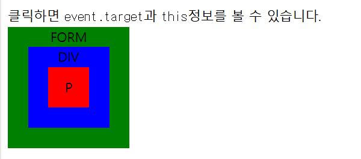
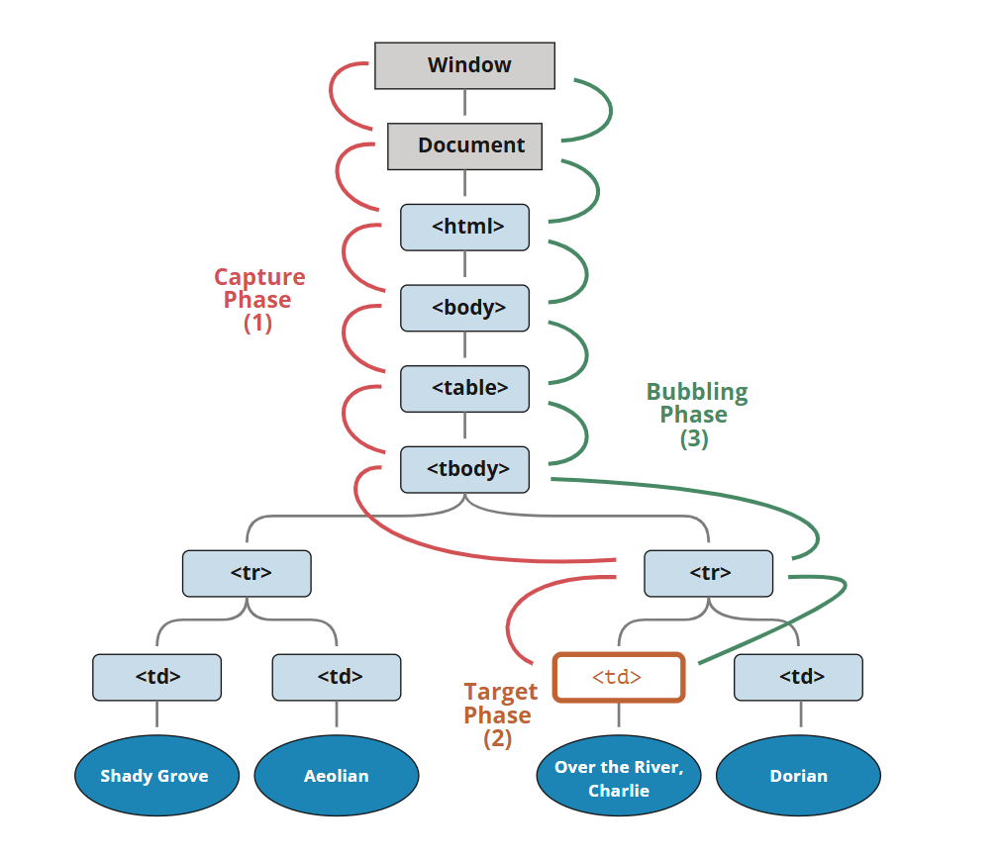

## 버블링과 캡쳐링

먼저 예시부터 보면

아래 핸들러는 `<div>`에 할당되어 있지만, `<em>` 이나 `<code>` 같은 중첩 태그를 클릭해도 동작한다.

```html
 <div onclick="alert('div에 할당한 핸들러!')">
      <em><code>EM</code>을 클릭했는데도 <code>DIV</code>에 할당한 핸들러가 동작합니다.</em>
    </div>
```

`<em>`을 클릭했는데 왜 `<div>`에 할당한 핸들러가 동작하는 걸까?

## 버블링

버블링의 원리는 간단하다.

**한 요소에 이벤트가 발생하면, 이 요소에 할당된 핸들러가 동작하고, 이어서 부모 요소의 핸들러가 동작한다. 가장 최상단의 조상 요소를 만날 때까지 이 과정이 반복되면서 요소 각각에 할당된 핸들러가 동작한다.

3개의 요소가 `FORM > DIV > P `형태로 중첩된 구조를 살펴보자. 요소 각각에 핸들러가 할당되어 있다.

```html
 <style>
      body * {
        margin: 10px;
        border: 1px solid blue;
      }
    </style>

    <form onclick="alert('form')">FORM
      <div onclick="alert('div')">DIV
        <p onclick="alert('p')">P</p>
      </div>
    </form>
```    

가장 안쪽의 `<P>` 를 클릭하면 순서대로 다음과 같은 일이 벌어진다.

1. `<p>`에 할당된 `onclick` 핸들러가 동작한다.
2. 바깥의 `<div>`에 할당된 핸들러가 동작한다.
3. 그 바깥의 `<form>`에 할당된 핸들러가 동작한다.
4. `document` 객체를 만날 때까지, 각 요소에 할당된 `onclick` 핸들러가 동작한다.

이런 동작 방식 때문에 `<p>` 요소를 클릭하면 `p` -> `div` -> `form` 순서로 3개의 얼럿 창이 뜬다.

이런 흐름을 '이벤트 버블링' 이라고 부른다. 이벤트가 제일 깊은 곳에 있는 요소에서 시작해 부모 요소를 거슬러 올라가며 발생하는 모양이 마치 물속 거품(bubble)과 닮았기 때문이다.

**거의 모든 이벤트는 버블링 된다**    
`focus` 이벤트와 같이 버블링 되지 않는 이벤트도 있다.

## event.target

부모 요소의 핸들러는 이벤트가 정확이 어디서 발생했는지 등에 대한 자세한 정보를 얻을 수 있다.

**이벤트가 발생한 가장 안쪽의 요소는 타깃(target) 요소라고 불리고, `event.target`을 사용해 접근할 수 있다.

`event.target`과 `this` (=`event.currentTarget`)는 다음과 같은 차이점이 있다.

- `event.target` 은 실제 이벤트가 시작된 '타깃'요소이다. 버블링이 진행되어도 변하지 않는다.
- `this`는 '현재'요소로, 현재 실행 중인 핸들러가 할당된 요소를 참조한다.

예시를 보자 핸들러는 `form.onclick` 하나밖에 없지만 이 핸들러에서 폼 안의 모든 요소에서 발생하는 클릭 이벤트를 '잡아내고(catch)'있다. 클릭 이벤트가 어디서 발생했든 상관없이 `<form>` 요소까지 이벤트가 버블링 되어 핸들러를 실행시키기 때문이다.

`form.onclick` 핸들러 내의 `this`와 `event.target`은 다음과 같다.

- `this (event.currentTarget)` - `<form>` 요소에 있는 핸들러가 동작했기 때문에 `<form>` 요소를 가리킨다.
- `event.taget` - 폼 안쪽에 실제 클릭한 요소를 가리킨다.



사진의 코드는 아래와 같다.

js
```js 
form.onclick = function(event) {
  event.target.style.backgroundColor = 'yellow';

  // chrome needs some time to paint yellow
  setTimeout(() => {
    alert("target = " + event.target.tagName + ", this=" + this.tagName);
    event.target.style.backgroundColor = ''
  }, 0);
};
```
css
```css
form {
  background-color: green;
  position: relative;
  width: 150px;
  height: 150px;
  text-align: center;
  cursor: pointer;
}

div {
  background-color: blue;
  position: absolute;
  top: 25px;
  left: 25px;
  width: 100px;
  height: 100px;
}

p {
  background-color: red;
  position: absolute;
  top: 25px;
  left: 25px;
  width: 50px;
  height: 50px;
  line-height: 50px;
  margin: 0;
}

body {
  line-height: 25px;
  font-size: 16px;
}
```
html
```html
<!DOCTYPE HTML>
<html>

<head>
  <meta charset="utf-8">
  <link rel="stylesheet" href="example.css">
</head>

<body>
  클릭하면 <code>event.target</code>과 <code>this</code>정보를 볼 수 있습니다.

  <form id="form">FORM
    <div>DIV
      <p>P</p>
    </div>
  </form>

  <script src="script.js"></script>
</body>
</html>
```

`<form>` 요소를 정확히 클릭했을 때는 `event.target`과 `this`가 같다.

## 버블링 중단하기

이벤트 버블링은 타깃 이벤트에서 시작해서 `<html>`요소를 거쳐 `document` 객체를 만날 때까지 각 노드에서 모두 발생한다. 몇몇 이벤트는 `window` 객체까지 거슬러 올라가기도 한다. 이 때도 모든 핸들러가 호출된다.

그런데 핸들러에게 이벤트를 완전히 처리하고 난 후 버블링을 중단하도록 명령할 수도 있다.

이벤트 객체의 메서드인 `event.stopPropagation()`를 사용하면 된다.

아래 예시에서 `<button>` 을 클릭해도 `<body.onclick>`은 동작하지 않는다.

```html
<body onclick="alert(`버블링은 여기까지 도달하지 못합니다.`)">
  <button onclick="event.stopPropagation()">클릭해 주세요.</button>
</body>
```

**event.stoplmmediatePropagation()**    
한 요소의 특정 이벤트를 처리하는 핸들러가 여러개인 상황에서, 핸들러 중 하나가 버블링을 멈추더라도 나머지 핸들러는 여전히 동작한다.

`event.stopPropagation()`은 위쪽으로 일어나는 버블링은 막아주지만, 다른 핸들러들이 동작하는건 막지 못한다.

버블링을 멈추고, 요소에 할당된 다른 핸들러의 동작도 막으려면 `event.stopImmediatePropagation()`을 사용해야 한다. 이 메서드를 사용하면 요소에 할당된 특정 이벤트를 처리하는 핸들러 모두가 동작하지 않는다.

## 캡쳐링
이벤트엔 버블링 이외에도 '캡쳐링'이라는 흐름이 존재하낟. 실제 코드에서 자주 쓰이진 않지만 종종 유용한 경우가 있다.

표준 DOM 이벤트에서 정의한 이벤트 흐름엔 3가지 단계가 있다.

1. 캡쳐링 단계 - 이벤트가 하위 요소로 전파되는 단계
2. 타깃 단계 - 이벤트가 실제 타깃 요소에 전달되는 단계
3. 버블링 단계 - 이벤트가 상위 요소로 전파되는 단계

테이블 안의 `<td>` 를 클릭하면 어떻게 이벤트가 흐르는지 그림을 보고 이해하자.



`<td>`를 클릭하면 이벤트가 최상위 조상에서 시작해 아래로 전파되고(캡쳐링 단계), 이벤트가 타깃 요소에 도착해 실행된 후(타깃 단계), 다시 위로 전파된다.(버블링 단계) 이런 과정을 통해 요소에 할당된 이벤트 핸들러가 호출된다.

**캡쳐링 단계를 이용해야 하는 경우는 흔치 않기 때문에, 이전까진 주로 버블링만 보았다. 캡쳐링에 관한 코드를 발견하는 일은 거의 없을 것이다.**

`on<event>` 프로퍼티나 HTML 속성, `addEventListener(event, handler)`를 이용해 할당된 핸들러는 캡쳐링에 대해 전혀 알 수 없다. 이 핸들러들은 두 번째 혹은 세 번째 단계의 이벤트 흐름(타깃 단계와 버블링 단계) 에서만 동작한다.

캡쳐링 단계에서 이벤트를 잡아내려면 `addEventListener`의 `capture` 옵션을 `true`로 설정해야 한다.

```js
elem.addEventListener(..., {capture: true})
// 아니면, 아래 같이 {capture: true} 대신, true를 써줘도 됩니다.
elem.addEventListener(..., true)
```

`capture` 옵션은 두 가지 값을 가질 수 있다.
- `false`이면(default 값) 핸들러는 버블링 단계에서 동작한다.
- `true` 이면 핸들러는 캡쳐링 단계에서 동작한다.

공식적으론 총 3개의 이벤트 흐름이 있지만, 이벤트가 실제 타깃 요소에 전달되는 단계인 '타깃 단계'(두 번째 단계)는 별도로 처리되지 않는다. 캡쳐링과 버블링 단계의 핸들러는 타깃 단계에서 트리거된다.

아래 예시를 통해 캡쳐링과 버블링에 대해 살펴보자

```html
<style>
  body * {
    margin: 10px;
    border: 1px solid blue;
  }
</style>

<form>FORM
  <div>DIV
    <p>P</p>
  </div>
</form>

<script>
  for(let elem of document.querySelectorAll('*')) {
    elem.addEventListener("click", e => alert(`캡쳐링: ${elem.tagName}`), true);
    elem.addEventListener("click", e => alert(`버블링: ${elem.tagName}`));
  }
</script>
```

이 예시는 문서 내 요소 '전체'에 핸들러를 할당해서 어떤 핸들러가 동작하는지를 보여준다.

`<p>`를 클릭하면 다음과 같은 순서로 이벤트가 전달된다.

1. `HTML` -> `BODY` -> `FORM` -> `DIV` (캡쳐링 단계, 첫 번째 리스너)
2. `P` (타깃 단계, 캡쳐링과 버블링 둘 다에 리스너를 설정했기 때문에 두 번 호출된다)
3. `DIV` -> `FORM` -> `HTML`(버블링 단계, 두 번째 리스너)

`event.eventPhase` 프로퍼티를 이용하면 현재 발생 중인 이벤트 흐름의 단계를 알 수 있다. 반환되는 정수값에 따라 이벤트 흐름의 현재 실행 단계를 구분할 수 있다. 하지만 핸들러를 통해 흐름 단계를 알 수 있기 때문에 이 프로퍼티는 자주 사용되지 않는다.

**핸들러를 제거할 때 `removeEventListener` 가 같은 단계에 있어야 한다.**

`addEventListener(..., true)`로 핸들러를 할당해 줬다면, 핸들러를 지울 때, `removeEventListener(..., true)`를 사용해 지워야 한다. 같은 단계에 있어야 핸들러가 지워진다.

**같은 요소와 같은 단계에 설정한 리스너는 설정한 순서대로 동작한다.**

특정 요소에 `addEventListener`를 사용해 한 단계에 이벤트 핸들러를 여러개 설정했다면 이 핸들러들은 설정한 순서대로 동작한다.

```js
elem.addEventListener("click", e => alert(1)); // 첫 번째로 트리거됩니다.
elem.addEventListener("click", e => alert(2));
```

## 요약

이벤트가 발생하면 이벤트가 발생한 가장 안쪽 요소가 '타깃 요소'가 된다.
- 이벤트는 document에서 시작해 DOM 트리를 따라 `event.target`까지 내려간다. 이벤트는 트리를 따라 내려가면서 `addEventListener(...,true)`로 할당한 핸들러를 동작시킨다.    
`addEventListener(..., true)`의 `true`는 `{capture:true}`의 축약형이다.
- 이후 타깃 요소에 설정된 핸들러가 호출된다.
- 이후엔 이벤트가 `event.target`부터 시작해서 다시 최상위 노드까지 전달되면서 각 요소에 `on<event>`로 할당한 핸들러와 `addEventListener`로 할당한 핸들러를 동작시킨다.
`addEventListener`로 할당한 핸들러 중, 세 번째 인수가 없거나 `false`, `{capture: false}`인 핸들러만 호출된다.

각 핸들러는 아래와 같은 `event` 객체의 프로퍼티에 접근할 수 있다.

- `event.target` - 이벤트가 발생한 가장 안쪽의 요소
- `event.currentTarget` (=`this`)- 이벤트를 핸들링 하는 현재 요소(핸들러가 실제 할당된 요소)
- `event.eventPhase` - 현재 이벤트 흐름 단계(캡쳐링=1, 타깃=2, 버블링=3)

핸들러에서 `event.stopPropagation()`을 사용해 이벤트 버블링을 멈출 수 있다. 다만, 이 방법은 추천하지 않는다. 지금은 상위 요소에서 이벤트가 어떻게 쓰일지 확실치 않더라도, 추후에 버블링이 필요한 경우가 생기기 때문이다.

캡처링 단계는 거의 쓰이지 않고, 주로 버블링 단계의 이벤트만 다뤄진다. 이렇게 된 데는 논리적 배경이 있다.

현실에서 사고가 발생하면 지역 경찰이 먼저 사고를 조사한다. 그 지역에 대해 가장 잘 아는 기관은 지역 경찰이기 때문에 추가 조사가 필요하다면 그 이후에 상위 기관이 사건을 넘겨받는다.

이벤트 핸들러도 이와 같은 논리로 만들어졌다. 특정 요소에 할당된 핸들러는 그 요소에 대한 자세한 사항과 무슨 일을 해야 할지 가장 잘 알고 있다. <td>에 할당된 핸들러는 <td>에 대한 모든 것을 알고 있기 때문에 <td>를 다루는데 가장 적합하다. 따라서 <td>를 다룰 기회를 이 요소에 할당된 핸들러에게 가장 먼저 주는 것이다.

버블링과 캡처링은 '이벤트 위임(event delegation)'의 토대가 된다. 이벤트 위임은 강력한 이벤트 핸들링 패턴이다. 