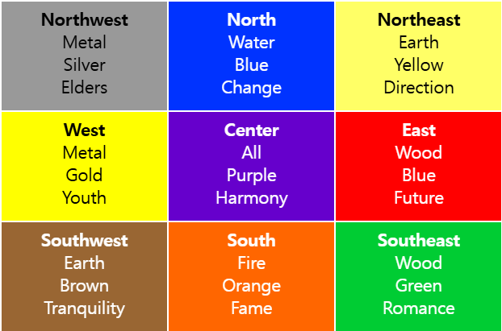

## 이벤트 위임

캡쳐링과 버블링을 활용하면 강력한 이벤트 핸들링 패턴인 이벤트 위임을 구현할 수 있다.

이벤트 위임은 비슷한 방식으로 여러 요소를 다뤄야 할 때 사용된다. 이벤트 위임을 사용하면 요소모다 핸들러를 할당하지 않고, 요소의 공통 조상에 이벤트 핸들러를 단 하나만 할당해도 여러 요소를 한꺼번에 다룰 수 있다.

공통 조상에 할당한 핸들러에서 `event.target` 을 이용하면 실제 어디서 이벤트가 발생했는지 알 수 있다. 이를 이용해 이벤트를 핸들링한다.

아래 사진은 팔괘도이다.



HTML은 대략 아래와 같다.

```html
<table>
  <tr>
    <th colspan="3"><em>Bagua</em> Chart: Direction, Element, Color, Meaning</th>
  </tr>
  <tr>
    <td class="nw"><strong>Northwest</strong><br>Metal<br>Silver<br>Elders</td>
    <td class="n">...</td>
    <td class="ne">...</td>
  </tr>
  <tr>...2 more lines of this kind...</tr>
  <tr>...2 more lines of this kind...</tr>
</table>
```

지금 해야 할 작업은 `<td>`를 클릭했을 때, 그 칸을 강조하는 것이다.

각 `<td>` 마다 `onclick`핸들러를 할당하는 대신, '모든 이벤트를 잡아내는' 핸들러를 `<table>` 요소에 할당해 보자.

`<table>` 요소에 할당하게 될 핸들러는 `event.target` 을 이용해 어떤 요소가 클릭 되었는지 감지하고, 해당 칸을 강조하게 된다.

코드는 아래와 같다.

```js
let selectedTd;

table.onclick = function(event) {
  let target = event.target; // 클릭이 어디서 발생했을까요?

  if (target.tagName != 'TD') return; // TD에서 발생한 게 아니라면 아무 작업도 하지 않습니다,

  highlight(target); // 강조 함
};

function highlight(td) {
  if (selectedTd) { // 이미 강조되어있는 칸이 있다면 원상태로 바꿔줌
    selectedTd.classList.remove('highlight');
  }
  selectedTd = td;
  selectedTd.classList.add('highlight'); // 새로운 td를 강조 함
}
```

이렇게 코드를 작성하면 테이블 내 칸의 개수는 고민거리가 되지 않는다. 강조기능을 유지하면서 `<td>`를 언제라도 넣고 뺄 수 있게 된다.

하지만 단점도 있다.

위와 같이 구현하면 클릭 이벤트가 `<td>` 가 아닌 `<td>` 안에서 동작할 수 있다.

팔괘도의 HTML을 보면 `<td>` 안에 중첩 태그 `<strong>`이 있다.

```html
<td>
  <strong>Northwest</strong>
  ...
</td>
```

`<strong>`을 클릭하면 event.target에 `<strong>`에 해당하는 요소가 저장된다.

따라서 `table.onclick` 핸들러에서 `event.target` 을 이용해 클릭 이벤트가 `<td>` 안쪽에서 일어났는지 아닌지를 알아내야 한다.

이런 단점을 반영하여 기능을 향상한 코드는 아래와 같다.

```js
table.onclick = function(event) {
  let td = event.target.closest('td'); // (1)

  if (!td) return; // (2)

  if (!table.contains(td)) return; // (3)

  highlight(td); // (4)
};
```

1. `elem.closet(selector)` 메서드는 `elem`의 상위 요소 중 `selector` 와 일치하는 가장 근접한 조상 요소를 반환한다. 위 코드에선 이벤트가 발생한 요소부터 시작해 위로 올라가며 가장 가까운 `<td>` 요소를 찾는다.

2. `event.target`이 `<td>` 안에 있지 않으면 그 즉시 `null`을 반환하므로 아무 작업도 일어나지 않는다.
3. 중첩 테이블이 있는 경우 `event.target` 은 현재 테이블 바깥에 있는 `<td>`가 될 수도 있다. 이런 경우를 처리하기 위해 `<td>`가 팔괘도 안에 있는지를 확인한다.
4. 이제 진짜 td를 강조해 준다.

이렇게 구현하면 `<td>`의 개수에 상관없이 원하는 `<td>`를 강조해주는 코드를 빠르고 효율적으로 구현할 수 있다.

## 이벤트 위임 활용하기

이벤트 위임을 다른 식으로도 활용할 수 있다.

'저장하기', '불러오기', '검색하기', 등의 버튼이 있는 메뉴를 구현해야 한다고 가정해보자. 각 버튼의 기능과 관련된 메서드 `save`, `load`, `search`,가 있는 객체도 이미 구현한 상태이다. 이럴 때 버튼과 메서드를 어떻게 연결할 수 있을까?

가장 먼저 버튼 각각에 독립된 핸들러를 할당하는 방법이 떠오른다. 하지만 이 방법보다 더 우아한 해결책이 있다. 메뉴 전체에 핸들러를 하나 추가해주고, 각 버튼의 `data-action` 속성에 호출할 메서드를 할당해 주는 방법이다.

    <button data-action "save">저장하기</button>

핸들러는 속성값을 읽고 적절한 메서드를 실행할 것이다.

```html
<div id="menu">
  <button data-action="save">저장하기</button>
  <button data-action="load">불러오기</button>
  <button data-action="search">검색하기</button>
</div>

<script>
  class Menu {
    constructor(elem) {
      this._elem = elem;
      elem.onclick = this.onClick.bind(this); // (*)
    }

    save() {
      alert('저장하기');
    }

    load() {
      alert('불러오기');
    }

    search() {
      alert('검색하기');
    }

    onClick(event) {
      let action = event.target.dataset.action;
      if (action) {
        this[action]();
      }
    };
  }

  new Menu(menu);
</script>
```

<div id="menu">
  <button data-action="save">저장하기</button>
  <button data-action="load">불러오기</button>
  <button data-action="search">검색하기</button>
</div>

<script>
  class Menu {
    constructor(elem) {
      this._elem = elem;
      elem.onclick = this.onClick.bind(this); // (*)
    }

    save() {
      alert('저장하기');
    }

    load() {
      alert('불러오기');
    }

    search() {
      alert('검색하기');
    }

    onClick(event) {
      let action = event.target.dataset.action;
      if (action) {
        this[action]();
      }
    };
  }

  new Menu(menu);
</script>

`(*)`로 표시한 줄의 `this.onClick`은 `this`에 바인딩했다는 점에 주의하자. 이렇게 하지 않으면 `this`는 `Menu` 객체가 아닌 DOM 요소(`elem`)를 참조하게 된다. 이렇게 되면 `this[action]` 에서 원하는 것을 얻지 못한다.

이런 식으로 이벤트 위임을 활용하면 아래와 같은 장점이 있다.

- 버튼마다 핸들러를 할당해주는 코드를 작성할 필요가 없어진다. 메서드를 만들고 HTML에 그 메서드를 써주기만 하면 된다.
- 언제든지 버튼을 추가하고 제거할 수 있어 HTML 구조가 유연해진다.

`.action-save`, `.action-load`같은 클래스를 사용할 수도 있지만, `data-action` 속성이 좀 더 의미론적으로 낫다. CSS 규칙을 적용할 수도 있게 된다.

## '행동' 패턴

이벤트 위임은 요소에 **선언전 방식**으로 '행동'을 추가할 때 사용할 수도 있다. 이때는 특별한 속성과 클래스를 사용한다.

행동 패턴은 두 부분으로 구성된다.

1. 요소의 행동을 설명하는 커스텀 속성을 요소에 추가한다.
2. 문서 전체를 감지하는 핸들러가 이벤트를 추적하게 한다. 1에서 추가한 속성이 있는 요소에서 이벤트가 발생하면 작업을 수행한다.

## 카운터 구현하기

버튼을 '클릭'하면 숫자가 증가하는 행동을 부여해주는 속성인 `data-counter`를 살펴보자

```html
첫 번째 카운터: <input type="button" value="1" data-counter>
두 번째 카운터: <input type="button" value="2" data-counter>

<script>
  document.addEventListener('click', function(event) {

    if (event.target.dataset.counter != undefined) { // 속성이 존재할 경우
      event.target.value++;
    }

  });
</script>
```
첫 번째 카운터: <input type="button" value="1" data-counter>
두 번째 카운터: <input type="button" value="2" data-counter>

<script>
  document.addEventListener('click', function(event) {

    if (event.target.dataset.counter != undefined) { // 속성이 존재할 경우
      event.target.value++;
    }

  });
</script>

버튼을 클릭하면 숫자가 증가한다. 접근방식에 대해 알아보자.

`data-counter` 속성이 있는 요소는 원하는 만큼 만들 수 있다. 필요할 때마다 HTML에 추가해주면 되니까. 예시에선 이벤트 위임을 사용해 새로운 행동을 선언해주는 속성을 추가해서 HTML을 '확장'하였다.

## 토글러 구현하기

행동 패턴에 관한 예시를 하나 더 보자. 이번엔 `data-toggle-id` 속성이 있는 요소를 클릭하면 속성값이 `id`인 요소가 나타나거나 사라지게 해보자

```html
<button data-toggle-id="subscribe-mail">
  구독 폼 보여주기
</button>

<form id="subscribe-mail" hidden>
  메일 주소: <input type="email">
</form>

<script>
  document.addEventListener('click', function(event) {
    let id = event.target.dataset.toggleId;
    if (!id) return;

    let elem = document.getElementById(id);

    elem.hidden = !elem.hidden;
  });
</script>
```

<button data-toggle-id="subscribe-mail">
  구독 폼 보여주기
</button>

<form id="subscribe-mail" hidden>
  메일 주소: <input type="email">
</form>

<script>
  document.addEventListener('click', function(event) {
    let id = event.target.dataset.toggleId;
    if (!id) return;

    let elem = document.getElementById(id);

    elem.hidden = !elem.hidden;
  });
</script>

자바스크립트를 사용하지 않고도 요소에 토글 기능을 추가할 수 있다는 점에 주목하자. 태그에 `data-toggle-id` 속성만 추가하면 요소를 토글할 수 있다.

행동 패턴을 응용하면 토글 기능이 필요한 요소 전체에 자바스크립트로 해당 기능을 구현해 주지 않아도 되기 때문에 매우 편리하다. '행동'을 선언해 주기만 하면 되기 때문이다. 문서 레벨에 적절한 핸들러를 구현해주기만 하면 페이지 내 모든 요소에 행동을 쉽게 적용할 수 있다.

한 요소에 여러 개의 행동을 조합해 적용하는 것도 가능하다.

이런 '행동' 패턴은 자바스크립트 미니 프래그먼트의 대안이 될 수 있다.

## 요약

이벤트 위임은 상당히 멋진 패턴이다. DOM 이벤트에 적용할 수 있는 아주 유용한 패턴이다.

이벤트 위임은 유사한 요소에 동일한 핸들러를 적용할 때 주로 사용하지만 꼭 이런 경우에만 사용할 수 있는 것은 아니다.

이벤트 위임은 다음과 같은 알고리즘으로 동작한다.

1. 컨테이너에 하나의 핸들러를 할당한다.
2. 핸들러의 `event.target`을 사용해 이벤트가 발생한 요소가 어디인지 알아낸다.
3. 원하는 요소에서 이벤트가 발생했다고 확인되면 이벤트를 핸들링한다.

이벤트 위임의 장점은 아래와 같다.

- 많은 핸들러를 할당하지 않아도 되기 때문에 초기화가 단순해지고 메모리가 절약된다.
- 요소를 추가하거나 제거할 때 해당 요소에 할당된 핸들러를 추가하거나 제거할 필요가 없기 때문에 코드가 짧아짐
- `innerHTML` 이나 유사한 기능을 하는 스크립트 요소 덩어리를 뺄 수 있기 때문에 DOM 수정이 쉬워진다.


