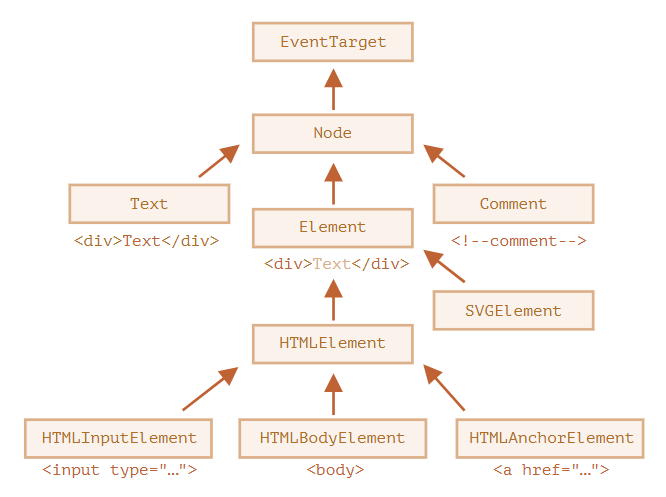

## 주요 노드 프로퍼티

DOM 노드를 좀 더 알아보자

## DOM 노드 클래스

DOM 노드는 종류에 따라 각각 다른 프로퍼티를 지원한다. 태그 `<a>`에 대응하는 요소 노드엔 링크 관련된 프로퍼티를, `<input>` 에 대응하는 요소 노드엔 입력 관련프로퍼티를 제공한다. 텍스트 노드는 요소 노드와 다른 프로퍼티를 지원하는 것은 말할 필요도 없다. 그런데 모든 DOM 노드는 공통 조상으로부터 만들어지기 때문에 노드 종류는 다르지만, 모든 DOM 노드는 공통된 프로퍼티와 메서드를 지원한다.

DOM 노드는 종류에 따라 대응하는 내장 클래스가 다르다.

계층 구조 꼭대기엔 **EventTarget**이 있는데, **Node**는 EventTarget을 다른, DOM 노드들은 Node 클래스를 상속 받는다.

이런 관계를 그림으로 나타내면 다음과 같다.

각 클래스는 다음과 같은 특징을 가진다.
- `EventTarget` - 루트에 있는 '추상'클래스로, 이 클래스에 대응하는 객체는 실제로 만들어지지 않는다.
EventTarget가 모든 DOM 노드의 베이스에 있기 때문에 DOM 노드에서 '이벤트'를 사용할 수 있다.
- `Node` - 역시 '추상'클래스로, DOM 노드의 베이스 역할을 한다. getter 역할을 하는 `parentNode`, `nextSibling`, `childNodes` 등의 주요 트리 탐색 기능을 제공한다. `Node` 클래스의 객체는 절대 생성되지 않는다. 하지만 이 클래스를 상속받는 클래스는 여럿 있습니다. 텍스트 노드를 위한 `Text` 클래스와 요소 노드를 위한 `Element` 클래스, 주석 노드를 위한 `Comment` 클래스는 `Node` 클래스를 상속 받는다.
- `Element` - DOM 요소를 위한 베이스 클래스이다. `nextElementSibling`, `children` 이나 `getElementByTagName`, `querySelector` 같이 요소 전용 탐색을 도와주는 프로퍼티나 메서드가 이를 기반으로 한다. 브라우저는 HTML뿐만 아니라 XML,SVG도 지원하는데 `Element` 클래스는 이와 관련된 `SVGElement`, `XMLElement`, `HTMLElement` 클래스의 베이스 역할을 한다.
- `HTMLElement` - HTML 요소 노드의 베이스 역할을 하는 클래스이다. 아래 나열한 클래스들은 실제 HTML 요소에 대응하고 `HTMLElement`를 상속 받는다.

   - `HTMLInputElement` - `<input>` 요소에 대응하는 클래스
   - `HTMLBodyElement` - `<body>` 요소에 대응하는 클래스
   - `HTMLAnchorElement` - `<a>` 요소에 대응하는 클래스
   - 이외에도 다른 클래스가 많은데, 각 태그에 해당하는 클래스는 고유한 프로퍼티와 메서드를 지원한다.

이렇게 특정 노드에서 사용할 수 있는 프로퍼티와 메서드는 상속을 기반으로 결정된다.

`<input>` 요소에 대응하는 DOM 객체를 예로 들어보자. 이 객체는 **HTMLInputElement** 클래스를 기반으로 만들어진다.

객체엔 아래에 나열한 클래스에서 상속받은 프로퍼티와 메서드가 있을 것이다.

- `HTMLInputElement` – 입력 관련 프로퍼티를 제공하는 클래스
- `HTMLElement` – HTML 요소 메서드와 `getter`, `setter`를 제공하는 클래스
- `Element` – 요소 노드 메서드를 제공하는 클래스
- `Node` – 공통 DOM 노드 프로퍼티를 제공하는 클래스
- `EventTarget` – 이벤트 관련 기능을 제공하는 클래스
- `Object` – `hasOwnProperty` 같이 ‘일반 객체’ 메서드를 제공하는 클래스

우리는 앞서 객체는 `constructor` 프로퍼티를 가진다는 걸 배운 적 있다. 이런 특징을 이용하면 DOM 노드 클래스 이름을 확인할 수 있다. `constructor` 프로퍼티는 클래스 생성자를 참조하고 이름은 `constructor.name`에 저장되어 있다는 점을 이용하면 된다.

    alert( document.body.constructor.name); // HTMLBodyElement

`toString`을 사용해도 된다.

    alert( document.body); // [object HTMLBodyElement]

상속 여부는 `instanceof`를 사용해 확인할 수 있다.

    alert( document.body instanceof HTMLBodyElement ); // true
    alert( document.body instanceof HTMLElement ); // true
    alert( document.body instanceof Element ); // true
    alert( document.body instanceof Node ); // true
    alert( document.body instanceof EventTarget ); // true

지금까지 본 바와 같이 