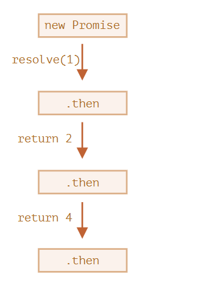
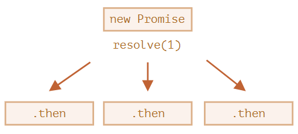

## 프라미스 체이닝

스크립트를 불러오는 것과 같이 순차적으로 처리해야 하는 비동기 작업이 여러 개 있다고 가정해보자. 어떻게 해야 이런 상황을 코드로 풀어낼 수 있을까??

프라미스를 사용하면 여러 가지 해결책을 만들 수 있다.

프라미스 체이닝(promise chaining)을 이용한 비동기 처리에 대해 알아보자.

아래와 같이 생겼다.

```js
new Promise(function(resolve, reject) {

  setTimeout(() => resolve(1), 1000); // (*)

}).then(function(result) { // (**)

  alert(result); // 1
  return result * 2;

}).then(function(result) { // (***)

  alert(result); // 2
  return result * 2;

}).then(function(result) {

  alert(result); // 4
  return result * 2;

});
```

프라미스 체이닝은 `result`가 `.then` 핸들러의 체인(사슬)을 통해 전달된다는 점에서 착안한 아이디어이다.

위 코드는 아래와 같은 순서로 실행된다.

1. 1초 후 최초 프라미스가 이행된다. - `(*)`
2. 이후 첫 번째 .`then`핸들러가 호출된다. - `(**)`
3. 2에서 반환한 값은 다음 `.then` 핸들러에 전달된다. - `(***)`
4. 이런 과정이 계속 이어짐

`result`가 핸들러 체인을 따라 전달되므로, `alert` 창엔 `1`,`2`,`4`가 순서대로 출력된다.



프라미스 체이닝이 가능한 이유는 `promise.then`을 호출하면 프라미스가 반환되기 때문이다. 반환된 프라미스엔 당연히 `.then`을 호출할 수 있다.

한편 핸들러가 값을 반환할 때엔 이 값이 프라미스의 `result`가 된다. 따라서 다음 `.then`은 이 값을 이용해 호출된다.

초보자는 프라미스 하나에 `.then`을 여러 개 추가한 후, 이를 체이닝이라고 착각하는 경우가 있다. 하지만 이는 체이닝이 아니다.

```js
let promise = new Promise(function(resolve, reject) {
  setTimeout(() => resolve(1), 1000);
});

promise.then(function(result) {
  alert(result); // 1
  return result * 2;
});

promise.then(function(result) {
  alert(result); // 1
  return result * 2;
});

promise.then(function(result) {
  alert(result); // 1
  return result * 2;
});
```

예시의 프라미스는 하나인데 여기에 등록된 핸들러는 여러 개이다. 이 핸들러들은 `result`를 순차적으로 전달하지 않고 독립적으로 처리한다.

그림으로 표현하면 다음과 같다.



동일한 프라미스에 등록된 `.then` 모두는 동일한 결과(프라미스의 `result`)를 받는다. 따라서 위 코드를 실행하면 얼럿 창엔 전부 `1`이 출력된다.

이런 식으로 한 프라미스에 여러 개의 핸들러를 등록해서 사용하는 경우는 거의 없다. 프라미스는 주로 체이닝을 해서 사용한다.

## 프라미스 반환하기
