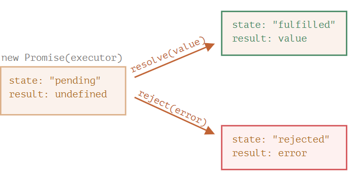
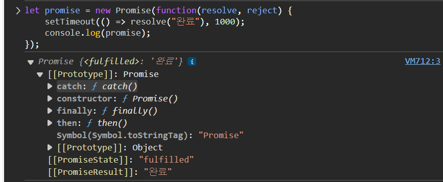
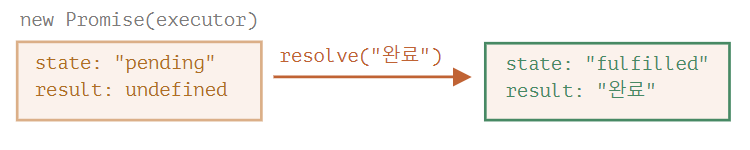
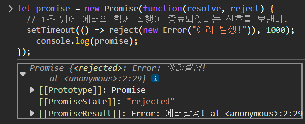

## 프로미스

`프라미스(Promise)`는 비동기 작업을 처리할 때 사용하는 자바스크립트 객체이다. **비동기 작업**이란, 시간이 좀 걸릴 수 있는 작업을 말하는데, 예를 들어 서버에서 데이터를 가져오는 일이 이에 해당된다. `프라미스`는 이런 작업이 끝났을 때(성공 or 실패) 그 결과를 처리할 수 있도록 해준다.

**비유로 이해해보자**    
1. `가수(제작 코드)` : 가수는 열심히 앨범을 녹음하고 있다. 녹음이 끝나야 팬들이 그 앨범을 들을 수 있다. 하지만 가수가 앨범을 언제 다 녹음할지는 알 수 없으니, 팬들이 계속 물어보는 대신, 가수는 앨범이 나오면 팬들에게 자동으로 알림을 보내겠다고 약속한다.

2. `구독 리스트(프라미스)` : 팬들은 가수에게 앨범이 나오면 알려달라고 이메일을 남긴다. 이 구독 리스트는 프라미스처럼, 팬들이 앨범이 준비되었을 때 결과를 받을 수 있도록 기다리게 해준다.

3. `팬(소비 코드)`: 팬들은 그저 가수가 앨범을 끝낼 때까지 기다린다. 가수가 앨범을 끝내면 이메일(결과)를 보내고, 팬들은 앨범을 즐길 수 있다. 

코드를 작성하면서 자주 만나는 상황을 아래 같은 상황으로 보자

1. `제작 코드`는 원격에서 스크립트를 불러오는 것 같은 시간이 걸리는 일을 한다. 위 비유에선 '가수'가 제작 코드에 해당된다.

2. `소비 코드(consuming code)`는 `제작 코드`의 결과를 기다렸다가 이를 소비한다. 이때 소비 주체(함수)는 여럿이 될 수 있다. 위 비유에서 소비 코드는 `팬`이다.

3. 프라미스는 `제작 코드`와 `소비 코드`를 연결해 주는 특별한 자바스크립트 객체이다. 위 비유에서 프라미스는 `구독 리스트`이다. `프라미스`는 시간이 얼마나 걸리든 상관없이 약속한 결과를 만들어 내는 `제작 코드`가 준비되었을 때, 모든 소비 코드가 결과를 사용할 수 있도록 해준다.

사실 프라미스는 구독 리스트보다 훨씬 복잡하기 때문에, 위 비유가 완벽하게 들어맞지는 않는다. 프라미스엔 더 많은 기능이 있고, 한계도 있다. 하지만 일단 이 비유를 이용해 프라미스를 학습해보자.

**실제 프라미스 동작**    
프라미스는 가수처럼 작업이 끝나면 결과를 알려주는 약속을 만든다. 프라미스를 만들 때는 `resolve`(성공) 와 `reject(실패)`라는 두 가지 약속을 사용한다.

`promise` 객체는 아래와 같은 문법으로 만들 수 있다.

```js
let promise = new Promise(function(resolve, reject){
  // executor (제작 코드, '가수')
});
```

`new Promise`에 전달되는 함수는 executor(실행자, 실행 함수)라고 부른다. executor는 `new Promise`가 만들어질 때 자동으로 실행되는데, 결과를 최종적으로 만들어내는 제작 코드를 포함한다. 위 비유에서 '가수'가 바로 executor이다.


대신 executor 에선 결과를 즉시 얻든 늦게 얻든 상관없이 상황에 따라 인수로 넘겨준 콜백 중 하나를 반드시 호출해야 한다.

- `resolve(value)` - 일이 성공적으로 끝난 경우 그 결과를 나타내는 `value`와 함께 호출
- `reject(error)` - 에러 발생 시 에러 객체를 나타내는 `error`와 함께 호출 

요약하면 다음과 같다. executor는 자동으로 실행되는데 여기서 원하는 일이 처리된다. 처리가 끝나면 executor는 처리 성공 여부에 따라 `resolve`나 `reject`를 호출한다.

한편, `new Promise` 생성자가 반환하는 `promise` 객체는 다음과 같은 내부 프로퍼티를 갖는다.

- `state` - 처음엔 `"pending"`(보류)이었다 `resolve`가 호출되면 `"fulfilled"`, `reject`가 호출되면 `"rejected"`로 변한다.
- `result` - 처음엔 `undefined`이었다. `resolve(value)`가 호출되면 `value`로, `reject(error)`가 호출되면 `error`로 변한다.

따라서 executor는 아래 그림과 같이 `promise`의 상태를 둘 중 하나로 변화시킨다.



'팬들'이 어떻게 이 변화를 구독할 수 있을까??

그 전에 `promise` 생성자와 간단한 executor 함수로 만든 예시를 살펴보자. `setTimeout`을 이용해 executor 함수는 약간의 시간이 걸리도록 구현해 보자.

```js
let promise = new Promise(function(resolve, reject) {
  // 프라미스가 만들어지면 executor 함수는 자동으로 실행된다.

  // 1초 뒤에 일이 성공적으로 끝났다는 신호가 전달되면서 result는 '완료'가 된다.
  setTimeout(() => resolve("완료"), 1000);
});
```



1. executor는 `new Promise`에 의해 자동으로 그리고 즉각적으로 호출된다.

2. executor는 인자로 `resolve`와 `reject` 함수를 받는다. 이 함수들은 자바스크립트 엔진이 미리 정의한 함수이므로 개발자가 따로 만들 필요는 없다. 다만, `resolve`나 `reject` 중 하나는 반드시 호출해야 한다.

executor '처리'가 시작 된 지 1초 후,, `resolve("완료")`이 호출되고 결과가 만들어진다. 이때 `promise` 객체의 상태는 다음과 같이 변한다 우선 개발자 도구 창에서 `console.log`로 확인하면 아래 사진과 같은 결과가 나온다.



일이 성공적으로 처리되었을 때의 프라미스는 'fulfilled promise(약속이 이행된 프라미스)'라고 불린다.

이번에는 executor가 에러와 함께 약속한 작업을 거부하는 경우를 살펴보자.

```js
let promise = new Promise(function(resolve, reject) {
  // 1초 뒤에 에러와 함께 실행이 종료되었다는 신호를 보낸다.
  setTimeout(() => reject(new Error("에러 발생!")), 1000);
});
```

1초 후 `reject(...)`가 호출되면 `promise`의 상태가 `"rejected"`로 변한다.



정리하자면, executor는 보통 시간이 걸리는 일을 수행한다. 일이 끝나면 `resolve`나 `reject` 함수를 호출하는데, 이때 프라미스 객체의 상태가 **변화**한다.

이행(resolved) 혹은 거부(rejected) 상태의 프라미스는 '처리된(settled)' 프라미스라고 부른다.

반대되는 프라미스로 '대기(pending)' 상태의 프라미스가 있다.


**프라미스는 성공 또는 실패만 한다.**

executor 는 `resolve`나 `reject` 중 하나를 반드시 호출해야 한다. 이때 변경된 상태는 더 이상 변하지 않는다. 

처리가 끝난 프라미스에 `resolve`와 `reject`를 호출하면 무시된다.

```js
let promise = new Promise(function(reslove, reject) {
  resolve("완료");

  reject(new Error("...")); // 무시됨
});
```

이렇게 executor에 의해 처리가 끝난 일은 결과 혹은 에러만 가질 수 있다.

여기에 더하여 `resolve`나 `reject`는 인수를 하나만 받고(혹은 아무것도 받지 않음) 그 이외의 인수는 무시한다는 특성도 있다.

**resolve,reject** 함수 즉시 호출하기 

executor는 대개 무언가를 비동기적으로 수행하고, 약간의 시간이 지난 후에 `resolve`, `reject`를 호출하는 데, 꼭 이렇게 할 필요는 없다. 아래와 같이 `resolve`나 `reject`를 즉시 호출할 수도 있다.

```js
let promise = new Promise(function(resolve, reject) {
  // 일을 마치는 데 시간이 들지 않음.
  resolve(123); // 결과(123)을 즉시 resolve에 전달한다.
});
```

어떤 일을 시작했는데 알고 보니 일이 이미 끝나 저장까지 되어있는 경우, 이렇게 `resolve`나 `reject`를 즉시 호출하는 방식을 사용할 수 있다.

이렇게 하면 프라미스는 즉시 이행 상태가 된다.

**state와 result**는 내부에 있다.

프라미스 객체의 `state`, `result` 프로퍼티는 내부 프로퍼티이므로 개발자가 직접 접근할 수 없다.

`.then`/`.catch`/`.finally` 메서드를 사용하면 접근 가능하다.

## 소비자: then, catch, finally
